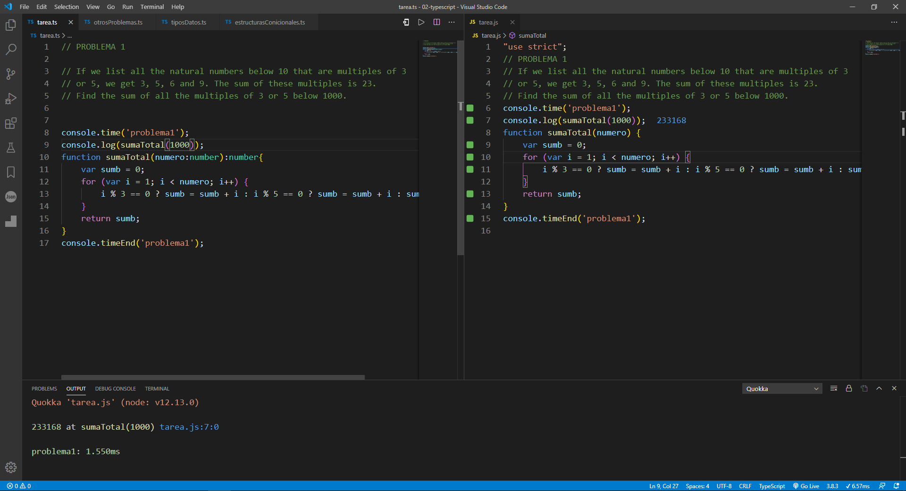
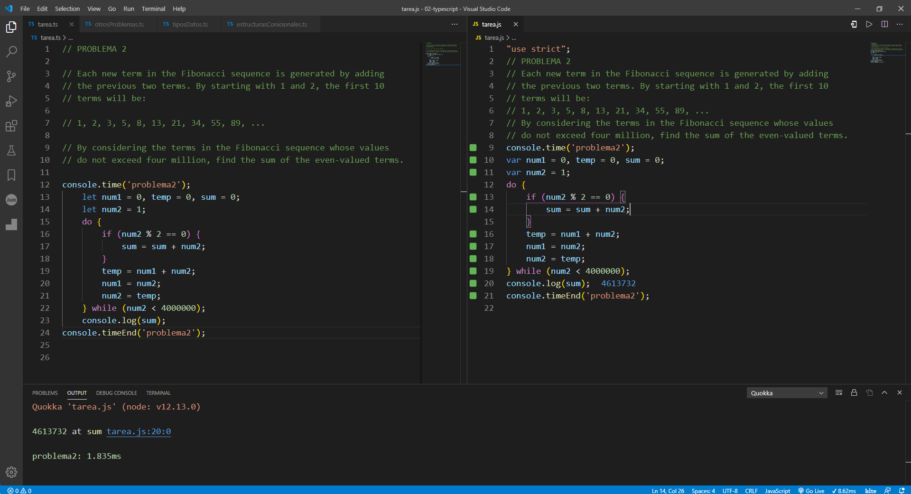
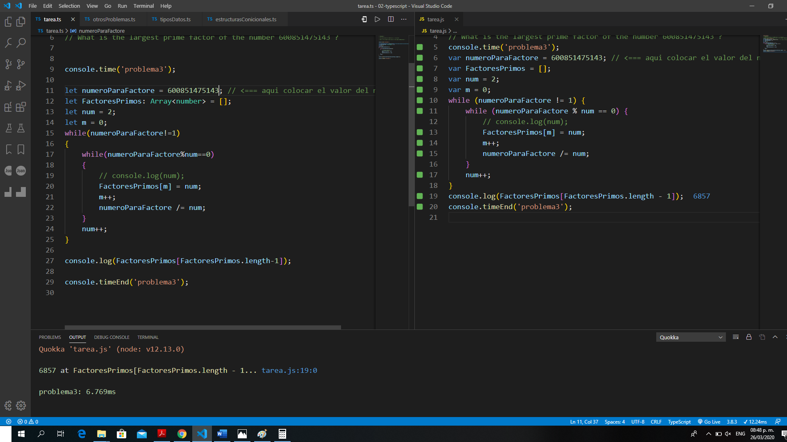

# TAREA 1

## Resolver los primeros 3 ejercicios de [Euler](https://projecteuler.net/archives) con typescript.

- ### PROBLEMA 1

If we list all the natural numbers below 10 that are multiples of 3 or 5, we get 3, 5, 6 and 9. The sum of these multiples is 23.

Find the sum of all the multiples of 3 or 5 below 1000.


>```typescript
>// PROBLEMA 1
>
>// If we list all the natural numbers below 10 that are multiples of 3 
>// or 5, we get 3, 5, 6 and 9. The sum of these multiples is 23.
>// Find the sum of all the multiples of 3 or 5 below 1000.
>
>
>console.time('problema1');
>console.log(sumaTotalP(1000));
>function sumaTotalP(numero:number):number{
>    var sumb = 0;
>    for (var i = 1; i < numero; i++) {
>        i % 3 == 0 ? sumb = sumb + i : i % 5 == 0 ? sumb = sumb + i : sumb = sumb;
>    }
>    return sumb;
>}
>console.timeEnd('problema1');
>```

<p align="center">
  
</p>

- ### PROBLEMA 2

Each new term in the Fibonacci sequence is generated by adding the previous two terms. By starting with 1 and 2, the first 10 terms will be:

1, 2, 3, 5, 8, 13, 21, 34, 55, 89, ...

By considering the terms in the Fibonacci sequence whose values do not exceed four million, find the sum of the even-valued terms.

>```typescript
>// PROBLEMA 2
>
>// Each new term in the Fibonacci sequence is generated by adding 
>// the previous two terms. By starting with 1 and 2, the first 10 
>// terms will be:
>
>// 1, 2, 3, 5, 8, 13, 21, 34, 55, 89, ...
>
>// By considering the terms in the Fibonacci sequence whose values 
>// do not exceed four million, find the sum of the even-valued terms.
>
>console.time('problema2');
>    let num1 = 0, temp = 0, sum = 0;
>    let num2 = 1;
>    do {
>        if (num2 % 2 == 0) {
>            sum = sum + num2;
>        }
>        temp = num1 + num2;
>        num1 = num2;
>        num2 = temp;
>    } while (num2 < 4000000);
>    console.log(sum);
>console.timeEnd('problema2');
>```

<p align="center">
  
</p>

- ### PROBLEMA 3

The prime factors of 13195 are 5, 7, 13 and 29.

What is the largest prime factor of the number 600851475143 ?

>```typescript
>// PROBLEMA 3
>
>// The prime factors of 13195 are 5, 7, 13 and 29.
>
>// What is the largest prime factor of the number 600851475143 ?
>
>
>console.time('problema3');
>
>let numeroParaFactore = 600851475143; // <=== aqui colocar el valor del numero
>let FactoresPrimos: Array<number> = [];
>let num = 2;
>let m = 0;
>while(numeroParaFactore!=1)
>{
>    while(numeroParaFactore%num==0)
>    {
>        // console.log(num);
>        FactoresPrimos[m] = num;
>        m++;
>        numeroParaFactore /= num;
>    }
>    num++;
>}
>
>console.log(FactoresPrimos[FactoresPrimos.length-1]);
>
>console.timeEnd('problema3');
>```

<p align="center">
  
</p>