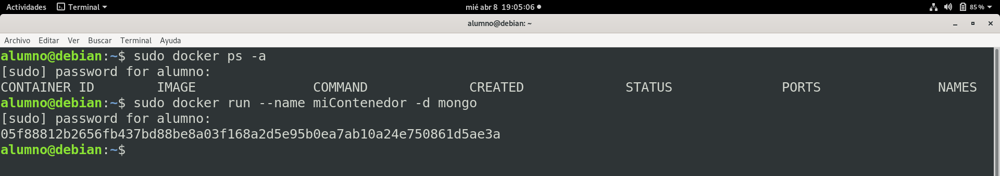

# TAREA 3

## Docker y Robo 3T


Pagina oficial de [Docker](https://www.docker.com/)

- ### Descargando una imagen de mongo, creando un contenedor e ingresando al contenedor ###

Viendo la versión de Docker

>```python
>$ docker --version
>```

<p align="center">
  
</p>

Descargando la imagen de mongo

>```python
>$ docker pull mongo
>```

<p align="center">
  
</p>

<p align="center">
  
</p>

Ahora se puede ver que se tiene la imagen de mongo descargada con:

>```python
>$ docker image ls
>```

Y también se puede listar los contenedores que se tiene y se verá que no tenemos ni un contenedor.

>```python
>$ docker pull mongo
>```

<p align="center">
  
</p>

Se puede crear un contenedor con el siguiente comando donde el nombre del contenedor sera **_miContenedor_**.

>```python
>$ docker run --name miContenedor -d mongo
>```

<p align="center">
  
</p>

Se puede listar todos los contenedores que creamos, en este caso al listar solo nos mostraría nuestro contenedor creado **_miContendor_**.

>```python
>$ docker ps -a
>```

<p align="center">
  
</p>

Una vez creado el contenedor se puede iniciar el contenedor detener el contenedor y eliminar el contendor.

>```python
># Se detiene el contenedor con:
>$ docker stop miContenedor
># tambien se puede colocar los primeros numeros de CONTAINER ID del contenedor (docker stop 923)
>```
>```python
># Se inicia el contenedor con:
>$ docker start miContenedor    
># tambien se puede colocar los primeros numeros de CONTAINER ID del contenedor (docker start 923)
>```
>```python
># Se elimina el contenedor con:
>$ docker rm miContenedor       
># tambien se puede colocar los primeros numeros de CONTAINER ID del contenedor (docker rm 923)
>```

Ejemplo de iniciar detener y eliminar un contenedor:

<p align="center">
  
</p>

Una vez creado un contenedor podemos ingresar al contenedor con:

>```python
>$ docker exec -it fe4 bash
># Donde fe4 es el CONTAINER ID del contenedor creado con nombre "miContenedor"
>```

***Ojo:*** Para Ingresar a un contenedor, el contenedor tiene que estar corriendo y si no esta corriendo debemos colocar el siguiente comando `docker start <nombreContenedor>` 

Una vez ingresado al contendor se puede notar que es una terminal de Linux, donde se puede colocar comandos de linux, en nuestro caso colocamos el comando `ls -l`.


<p align="center">
  
</p>

Como descargamos una imagen mongo, podremos ver que si ejecutamos el comando `mongo` en la terminal del contenedor, entrara a la terminal de mongo instalado en el contenedor.

>```python
>$ mongo        # esto en la terminal del contenedor
>```

<p align="center">
  
</p>

Y se puede ver que podemos crear bases de datos e insertar documentos.

<p align="center">
  
</p>

width="500" height="300"
