# TAREA 3

## Uso de Docker y Robo 3T

Docker es un programa de código abierto que permite que una aplicación Linux y sus dependencias se empaqueten como un contenedor. La virtualización basada en contenedores aísla las aplicaciones entre sí en un sistema operativo (OS) compartido. Este enfoque estandariza la entrega del programa de la aplicación, permitiendo que las aplicaciones se ejecuten en cualquier entorno Linux, ya sea físico o virtual. Dado que comparten el mismo sistema operativo, los contenedores son portátiles entre diferentes distribuciones de Linux, y son significativamente más pequeños que las imágenes de máquinas virtuales (VM).

Visita la pagina oficial de [Docker](https://www.docker.com/)

- ### _Descargando una imagen de mongo, creando un contenedor e ingresando al contenedor_ ###

Viendo la versión de Docker

>```ruby
>$ docker --version
>```

<p align="center">
  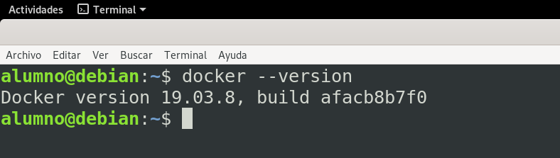
</p>

Descargando la imagen de mongo

>```ruby
>$ docker pull mongo
>```

<p align="center">
  
</p>

<p align="center">
  
</p>

Ahora se puede ver que se tiene la imagen de mongo descargada con:

>```ruby
>$ docker image ls
>```

Y también se puede listar los contenedores que se tiene y se verá que no tenemos ni un contenedor.

>```ruby
>$ docker pull mongo
>```

<p align="center">
  
</p>

Se puede crear un contenedor con el siguiente comando donde el nombre del contenedor sera **_miContenedor_**.

>```ruby
>$ docker run --name <nombreContenedor> -d mongo
>```

>```ruby
>$ docker run --name miContenedor -d mongo
>```

<p align="center">
  
</p>

Se puede listar todos los contenedores que creamos, en este caso al listar solo nos mostraría nuestro contenedor creado **_miContendor_**.

>```ruby
>$ docker ps -a
>```

<p align="center">
  
</p>

Una vez creado el contenedor se puede iniciar el contenedor detener el contenedor y eliminar el contendor.

>```ruby
># Se detiene el contenedor con:
>$ docker stop miContenedor
># tambien se puede colocar los primeros numeros de CONTAINER ID del contenedor (docker stop 923)
>```
>```ruby
># Se inicia el contenedor con:
>$ docker start miContenedor    
># tambien se puede colocar los primeros numeros de CONTAINER ID del contenedor (docker start 923)
>```
>```ruby
># Se elimina el contenedor con:
>$ docker rm miContenedor       
># tambien se puede colocar los primeros numeros de CONTAINER ID del contenedor (docker rm 923)
>```

Ejemplo de iniciar detener y eliminar un contenedor:

<p align="center">
  
</p>

Una vez creado un contenedor podemos ingresar al contenedor con:

>```ruby
>$ docker exec -it <nombreContenedor o ID contenedor> bash
>```

>```ruby
>$ docker exec -it fe4 bash
># Donde fe4 es el CONTAINER ID del contenedor creado con nombre "miContenedor"
>```

***Ojo:*** Para Ingresar a un contenedor, el contenedor tiene que estar corriendo y si no esta corriendo debemos colocar el siguiente comando `docker start <nombreContenedor>` 

Una vez ingresado al contendor se puede notar que es una terminal de Linux, donde se puede colocar comandos de linux, en nuestro caso colocamos el comando `ls -l`.


<p align="center">
  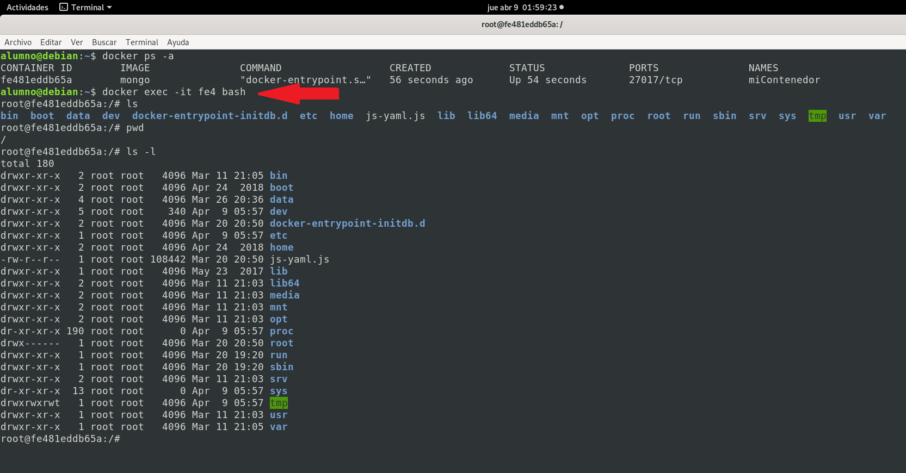
</p>

Como descargamos una imagen mongo, podremos ver que si ejecutamos el comando `mongo` en la terminal del contenedor, entrara a la terminal de mongo instalado en el contenedor.

>```ruby
>$ mongo        # esto en la terminal del contenedor
>```

<p align="center">
  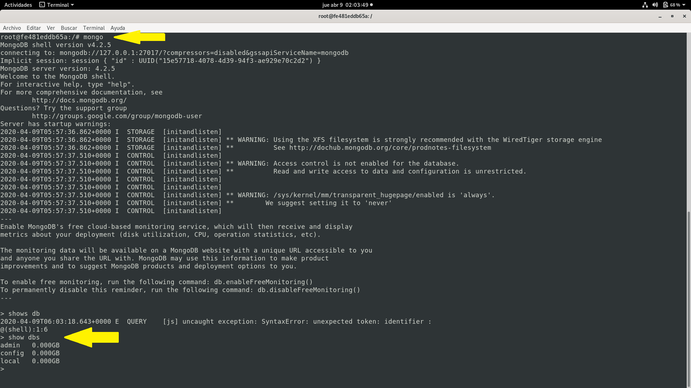
</p>

Y se puede ver que podemos crear bases de datos e insertar documentos.

<p align="center">
  
</p>

<br>
<br>

- ### Docker-compose y conectar con Robo 3T ###

Compose es una herramienta para definir y ejecutar aplicaciones Docker de contenedores múltiples. Con Compose, utiliza un archivo YAML para configurar los servicios de su aplicación. Luego, con un solo comando, crea e inicia todos los servicios desde su configuración.

[Docker-compose](https://docs.docker.com/compose/)

archivo utilizado para crear un contenedor con docker-compose con el nombre `dockercompose.yml`:

>```ruby
># version de docker compose que utilizaremos para compilar este archivo
>version: '3.7'
># servicios=contenedores que crearemos con docker compose
>services:
>  # primer servicio=contenedor
>  mongo:
>    # nombre del contenedor
>    container_name: miContenedor2
>    # imagen que usaremos
>    image: mongo
>    # reinicia el contenedor si algo sale mal
>    restart: always
>    # habilitar la autenticacion de mongo
>    command: [--auth]
>    # puertos
>    ports:
>      - 27017:27017
>    # variables de entorno
>    environment:
>      MONGO_INITDB_ROOT_USERNAME: root
>      MONGO_INITDB_ROOT_PASSWORD: root
>```

Para ejecutar el archivo `dockercompose.yml` se debe ejecutar la siguiente linea de comando.

>```ruby
>$ docker-compose -f <nombreArchivoDockerCompose> up -d
>```

En mi caso el archivo se llama `dockercompose.yml`

>```ruby
>$ docker-compose -f dockercompose.yml up -d
>```

Este docker-compose creara un contenedor con el nombre **_miContenedor2_**

<p align="center">
  
</p>

Luego de esto si listamos los contenedores con:

>```ruby
>$ docker ps -a
>```

Y veremos que ya tenemos dos contenedores creados y tambien se puede ver que **_miContenedor2_** ya se esta ejecutando y nos muestra el numero de puerto que esta ocupando este contenedor creado que es el **27017**.

**OJO :** 
Posteriormente ingresaremos al contenedor y algo importante es que si dos contenedores ocupan el mismo puerto, entonces para no tener problemas posteriores es bueno detener los demas contenedores que no utilizaremos, solo se debe tener ejecutando el contenedor que se utilizara.

<p align="center">
  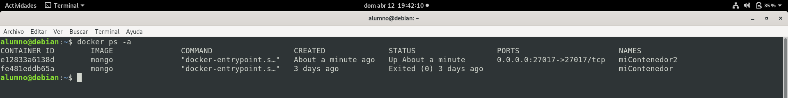
</p>

Ahora ingresaremos al contenedor **_miContenedor2_**

>```ruby
>$ docker exec -it miContenedor2 bash
>```

Y posteriormente podemos ejecutar mongo en la linea de comandos:

>```ruby
>$ mongo -u root -p root
>```

 En este caso colocamos `mongo -u root -p root` ya que en el archivo `dockercompose.yml` se configuró para que nuestro mongo dentro del contenedor creado tenga `usuario` y `contraseña` para tener seguridad

<p align="center">
  
</p>

Los comando ejecutados en mongo son:

>```javascript
> use dbPrueba
> db.alumno.insert({"name": "cristian", "apellido": "choque"})
> db.alumno.find().pretty()
>```

<p align="center">
  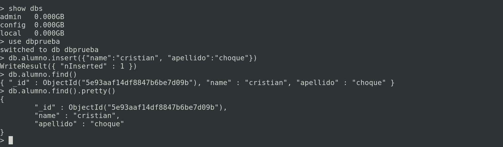
</p>

Ahora utilizaremos Robo 3T para conectar a nuestro mongo del contenedor, esto para ver los datos de manera grafica. Con Robo 3T podremos de igual manera crear bases de datos, asi tambien crear colecciones, insertar, eliminar y actualizar documentos y todo esto se podra ver de igual manera en el contenedor creado anteriormente.

Primeramente abriremos Robo 3T.

- click en `"Manage Connections"`

<p align="center">
  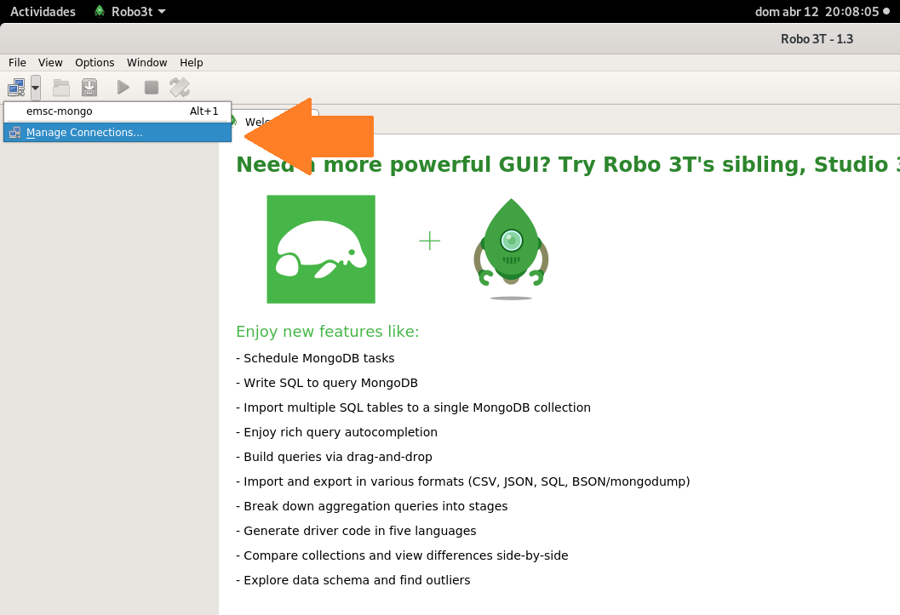
</p>

Primeramente en la pestaña **`Connection`**.

- Crearemos nueva conección haciendo click en **`"create"`**.
- Colocaremos un nombre a nuestra conección **`"Name: miContenedor2"`**.
- Colocamos la direccion, como es localmente sera **`"Address: localhost"`**.
- Colocaremos el numero del puerto del contenedor que como vimos anteriormente es **`"27017"`**.

<p align="center">
  
</p>

Seguidamente en la pestaña **`Authentication`**, y luego habililtar **`"Perfom authentication"`** .

- En Base de datos colocamos **`"Database: admin"`**.
- Colocaremos el nombre de usuario **`"User Name: root"`**.
- Colocaremos la contraseña **`"Password: root"`**.

Luego hacer click en **`"Test"`**.

<p align="center">
  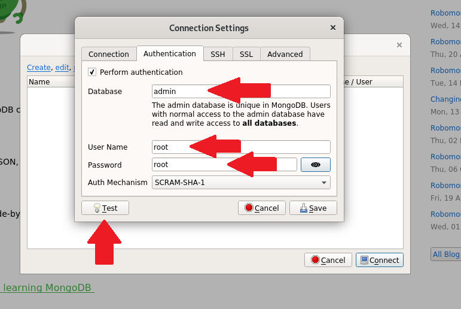
</p>

Y si la conección con el mongo del contenedor es satisfactoria nos mostrara lo siguiente:

<p align="center">
  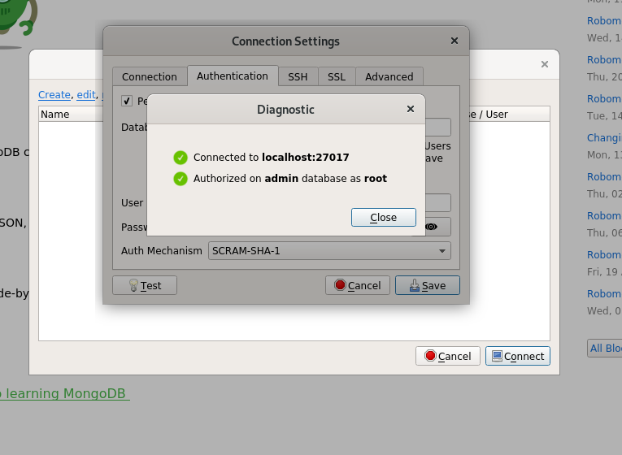
</p>

Luego lo guardamos haciendo click en **`"Save"`**.

<p align="center">
  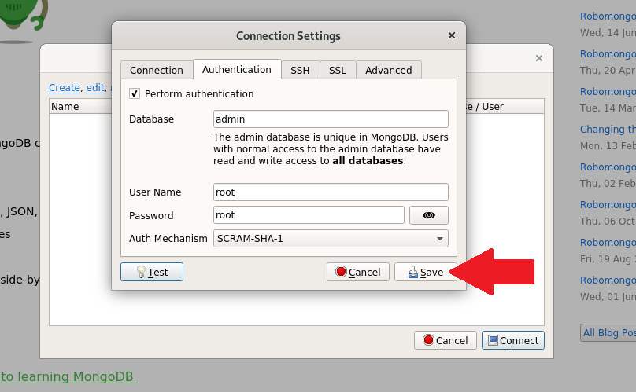
</p>

Y veremos que se guarda una conección con el nombre **_`"miContenedor2"`_** en **`"MongoDB Connections"`**, el cual podemos conectar haciendo click en **`"Connect"`**.

<p align="center">
  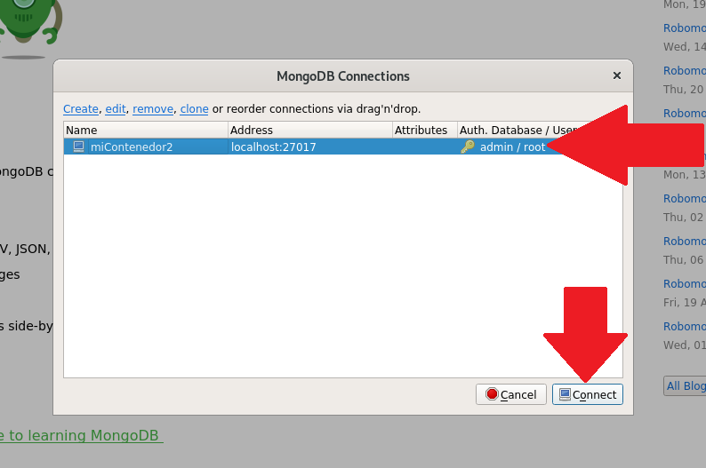
</p>

Y luego de conectar, se podra ver las bases de datos que tenga el MongoDB dentro del contenedor.

Y se puede ver claramente una Base de Datos con el nombre `dbPrueba` con una colleción llamada `alumno` y esta collección con los datos `nombre: "Cristian"` y `apellido: "Choque"` que fueron creados anteriormente cuando ingresamos al mongo del contenedor con `mongo -u root -p root`.

<p align="center">
  
</p>

En mongoDB podemos crear usuarios que pueda administrar la Base de Datos.

Aqui crearé un usuario con el nombre "cristian" y la contraseña "cristian" con permisos de lectura y escritura `(readWrite)` y esto se aplicara a la Base de Datos con el nombre `dbPrueba`.

>```javascript
>db.createUser({
>    user: "cristian",
>    pwd: "cristian",
>    roles: [
>        {role: "readWrite", db: "dbprueba"},
>    ],
>})
>```

<p align="center">
  
</p>

Copiamos el codigo y lo pegamos en la terminal de mongo ingresando con `mongo -u root -p root` y luego de presionar Enter el usuario de adicionará satisfactoriamente.

<p align="center">
  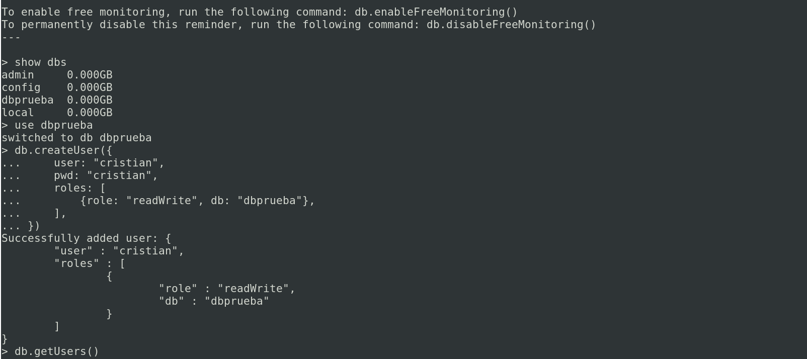
</p>

Ahora volviendo al Robo 3T seguiremos los pasos anteriormente mencionados `Crearemos nueva conección`.

- Colocaremos un nombre a nuestra conección **`"Name: dbPrueba"`**.
- Colocamos la direccion, como es localmente sera **`"Address: localhost"`**.
- Colocaremos el numero del puerto del contenedor que como vimos anteriormente es **`"27017"`**.

<p align="center">
  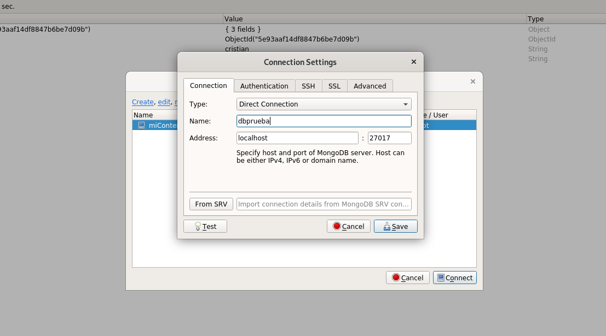
</p>

Luego en la pestaña **`Authentication`**.

- En Base de datos colocamos **`"Database: dbPrueba"`**.
- Colocaremos el nombre de usuario **`"User Name: cristian"`**.
- Colocaremos la contraseña **`"Password: cristian"`**.

<p align="center">
  
</p>

Y haciendo click en `Test` veremos que luego de conectarce satisfactoriamente se creará la nueva conección `dbPrueba`. 

<p align="center">
  
</p>

Ahora nos conectaremos a `dbPrueba`.

<p align="center">
  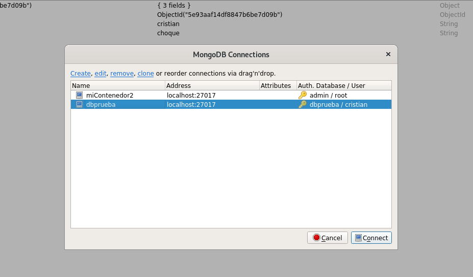
</p>

Y veremos lo siguiente, una conección `dbPrueba`, y como ingresamos con el usuario que creamos se puede ver que solo nos muestra la base de datos `dbPrueba` con los mismos datos vistos anteriormente, pero como la Autenticación se hizo como `usuario cristian` se ve claramente que solo tenemos acceso a la base de datos `dbPrueba` y no a las demas.

<p align="center">
  
</p>

Ahora si queremos ingresar a mongoDb Autenticado como cristian, en la liena de comando hacemos lo siguiente:

>```ruby
>$ mongo dbPreuba -u cristian -p cristian
>```

Con lo cual ingresaremos Autenticados como `cristian` y de la misma manera solo tendremos acceso a la Base de Datos `dbPrueba`.
<p align="center">
  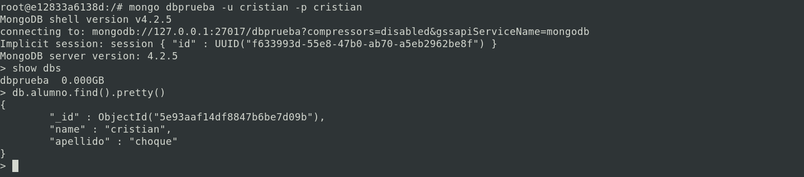
</p>