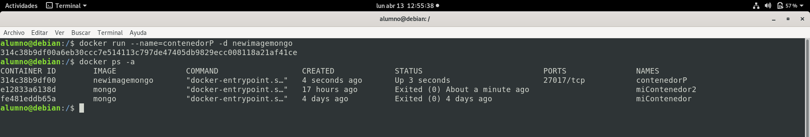
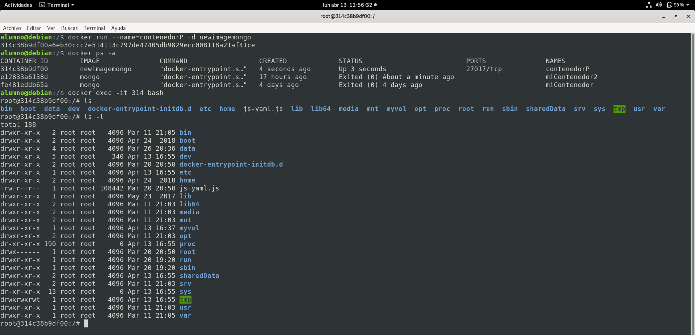
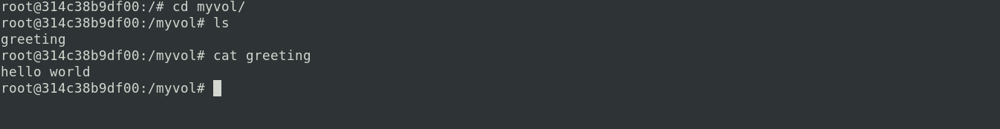
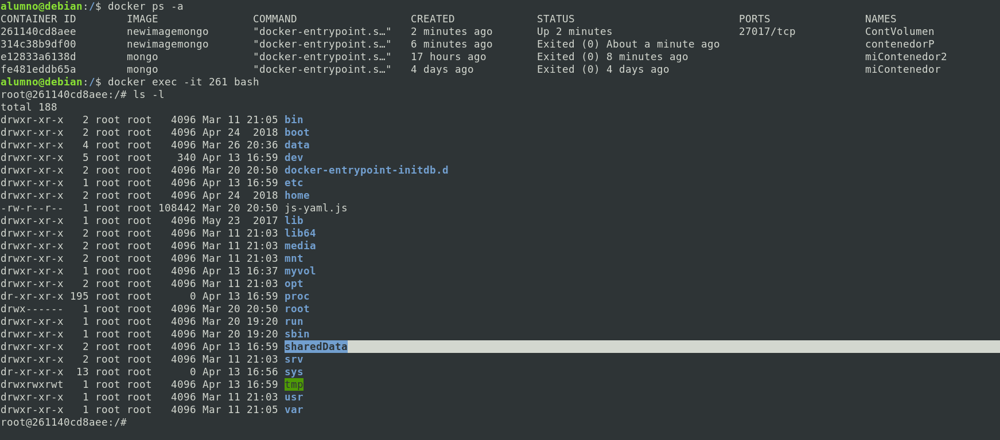
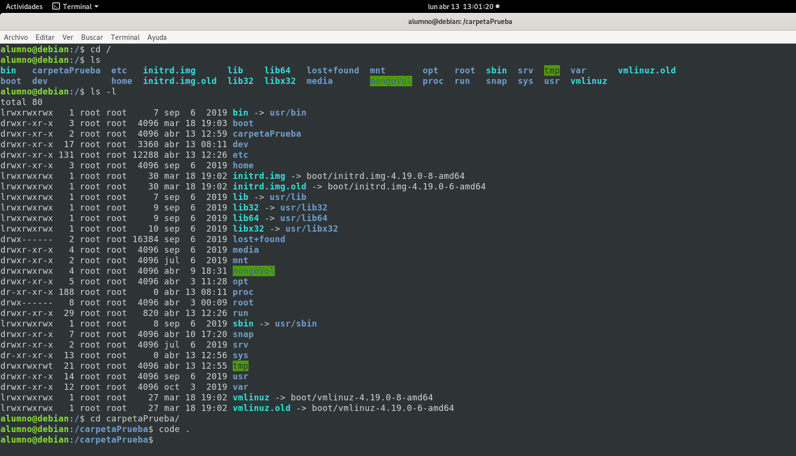
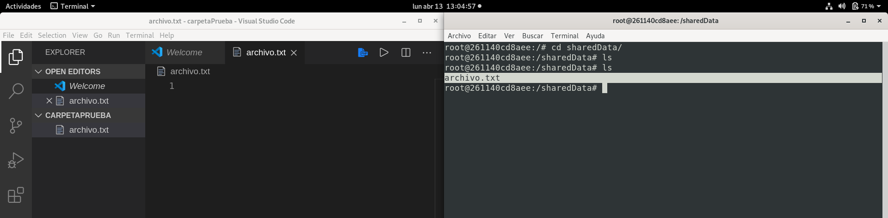
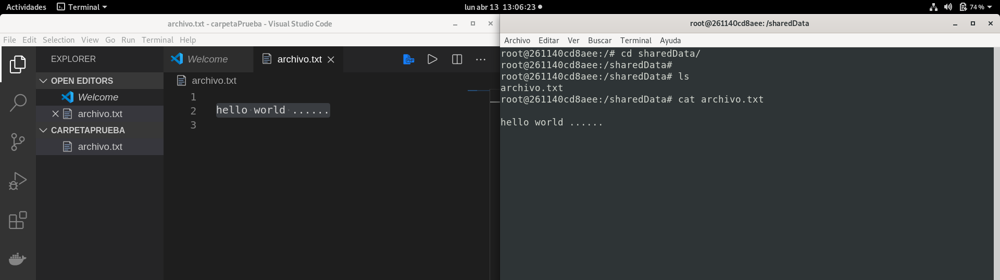

# TAREA 4

## Uso de Docker y Robo 3T

Docker es un programa de código abierto que permite que una aplicación Linux y sus dependencias se empaqueten como un contenedor. La virtualización basada en contenedores aísla las aplicaciones entre sí en un sistema operativo (OS) compartido. Este enfoque estandariza la entrega del programa de la aplicación, permitiendo que las aplicaciones se ejecuten en cualquier entorno Linux, ya sea físico o virtual. Dado que comparten el mismo sistema operativo, los contenedores son portátiles entre diferentes distribuciones de Linux, y son significativamente más pequeños que las imágenes de máquinas virtuales (VM).

Visita la pagina oficial de [Docker](https://www.docker.com/)

- ### Dockerfile ###

Docker puede construir imágenes automáticamente leyendo las instrucciones de un Dockerfile. Un Dockerfile es un documento de texto que contiene todos los comandos que un usuario podría llamar en la línea de comandos para ensamblar una imagen. Los usuarios de Docker Build pueden crear una compilación automatizada que ejecuta varias instrucciones de línea de comandos en sucesión.

[Dockerfile](https://docs.docker.com/engine/reference/builder/)


- ### _Uso de Dockerfile_ ###

Archivo utilizado para crear una imagen utilizando dockerfile con el nombre `dockerfile`:

>```ruby
>FROM mongo AS mongomod
>RUN mkdir /myvol
>RUN echo "hello world" > /myvol/greeting
>VOLUME /sharedData
>```

para ejecutar el archivo dockerfile

>```ruby
>$ docker build -t <nombreNuevaImagen>:latest .
>```

**OJO** Es necesario que estemos en la misma ubicación del archivo antes de ejecutar. 

Para mi caso le colocare `newimagemongo` como nombre de mi nueva imagen.

>```ruby
>$ docker build -t newimagemongo:latest .
>```

Esto ejecutara linea por linea el archivo `dockerfile` y creará una nueva imagen satisfactoriamente.

<p align="center">
  
</p>

Una vez creada la nueva imagen, también se creó una carpeta con el nombre `myvol` en la dirección origen de linux.

>```ruby
>$ cd /
>$ ls -l
>```

Y veremos una carpeta con el nombre `myvol` y es esta carpeta que sera compartida con la carpeta del contenedor `sharedData`, es decir que todos los archivos que coloquemos en la carpeta `myvol (que esta en la dirección origen de linux)` se veran en la carpeta `sharedData (que esta en la direccion origen del contenedor que se creará posteriormente)`. 


<p align="center">
  
</p>

Ahora crearemos un contenedor con la imagen creada `newimagemongo`.

>```ruby
>$ docker run --name=contenedorP -d newimagemongo
>```

Y podemos listar los contenedores con:

>```ruby
>$ docker ps -a
>```

<p align="center">
  
</p>

Ahora ingresaremos al contenedor `contenedorP` creado.

>```ruby
>$ docker exec -it 314 bash  # Donde 314 es el ID CONTAINER del contenedor
>```

Y una vez ingresado al contenedor.

>```ruby
>$ ls -l
>```

Veremos que hay una carpeta con el nombre `sharedData` que es la carpeta compartida con la carpeta `myvol`. 

<p align="center">
  
</p>

Tambien veremos en la shell del contenedor que se creó una carpeta con el nombre `myvol` y al interior de la carpeta se creo un archivo con el nombre `greeting`.

>```ruby
>$ cd myvol
>$ ls
>$ cat greeting
>```

<p align="center">
  
</p>

Para eliminar una imagen.

>```ruby
>$ docker rm newimagemongo
>```

Y al listar las imagenes se vera que ya no existe la imagen `newimagemongo`.

Ahora crearemos otro contenedor, pero como eliminamos la imagen debemos crearlo nuevamente (usaremos el siguiente codigo `dockerfile` para crear la imagen).

>```ruby
>FROM mongo AS mongomod
>RUN mkdir /carpetaPrueba
>RUN echo "hello world" > /myvol/greeting
>VOLUME /sharedData
>```

>```ruby
>$ docker build -t newimagemongo:latest .
>```

Ahora crearemos un contenedor con la imagen creada `newimagemongo`.

>```ruby
>$ docker run --name=ContVolumen -d newimagemongo
>```

Y podemos listar los contenedores con:

>```ruby
>$ docker ps -a
>```

Ahora ingresaremos al contenedor `ContVolumen` creado.

>```ruby
>$ docker exec -it 261 bash  # Donde 261 es el ID CONTAINER del contenedor
>```

<p align="center">
  
</p>

Ahora compartiremos los archivos de `carpetaPreuba` de linux con `sharedData` del contenedor.

<p align="center">
  
</p>

Por un lado tengo la carpeta con nombre `carpetaPrueba` abierta desde `visual studio code` y por otro lado en la terminal en el contenedor en la carpeta con nombre `sharedData`. 

<p align="center">
  
</p>

Creo un archivo con el nombre `archivo.txt` y si listamos en la terminal se vera que tambien se creo el mismo archivo en el contenedor.

<p align="center">
  
</p>

Y si en el archivo coloco un teto `hello world ......` y en la terminal veo el contenido del archivo con `cat archivo.txt`, se vera el contenido del archivo que es el mismo que colocamos desde `visual studio code`. 

<p align="center">
  
</p>

## Tarea: Crear un contenedor mongo y otro contenedor donde se instale node y TipeScript ##

Para esto lo haremos con docker-compose.

- ### Primero crearemos un contenedor con el nombre `mongo`, el archivo tendra el nombre `DCforMongo.yml`.

>```ruby
># version de docker compose que utilizaremos para compilar este archivo
>version: '3.7'
># servicios=contenedores que crearemos con docker compose
>services:
>  # primer servicio=contenedor
>  mongo:
>    # nombre del contenedor
>    container_name: mongo
>    # imagen que usaremos
>    image: newimagemongo
>    # reinicia el contenedor si algo sale mal
>    restart: always
>    # volumenes a compartir
>    volumes:
>      - /dataFromMongo:/sharedData
>      # y guarda todos los datos generados en la ruta "/dataDB/db"
>      - mongodatabases:/datasDB/db
>    # habilitar la autenticacion de mongo
>    command: [--auth]
>    # puertos
>    ports:  
>      - 27017:27017
>    # variables de entorno
>    environment:
>      MONGO_INITDB_ROOT_USERNAME: root
>      MONGO_INITDB_ROOT_PASSWORD: root
># volumenes declarados para su uso
>volumes:
>    # primer volumen 
>    mongodatabases:
>      # nombre del volumen
>      name: mongodatabases
>```

Para ejecutar el archivo `DCforMongo.yml` se debe ejecutar la siguiente linea de comando.

>```ruby
>$ docker-compose -f DCforMongo.yml up -d
>```

Este docker-compose creara un contenedor con el nombre **_mongo_**.

Luego de esto si listamos los contenedores con:

>```ruby
>$ docker ps -a
>```

Y veremos que ya tenemos creado el contenedor `mongo` y tambien se puede ver que el contenedor `mongo` ya se esta ejecutando y nos muestra el numero de puerto que esta ocupando este contenedor creado que es el **27017**.

Y el contenido de la carpeta con el nombre `sharedData` (esta carpeta es del contenedor) es compartida con la carpeta con el nombre `dataFromMongo` (esta carpeta esta en la direccion origen de Linux).

Para ingresar a mongo desde la terminal o desde Robo 3T, no olvidar que el `user` y el `password` es `root` o puede colocar el usuario y contraseña que configuró en el archivo `docker-compose`.

>```ruby
>$ mongo -u root -p root
>```

- ### Ahora crearemos un contenedor con el nombre `tscNodejs`, el archivo tendra el nombre `DCforTSC.yml`.

>```ruby
># version de docker compose que utilizaremos para compilar este archivo
>version: '3.7'
># servicios=contenedores que crearemos con docker compose
>services:
>  # primer servicio=contenedor
>  mongo:
>    # nombre del contenedor
>    container_name: tscNodejs
>    # imagen que usaremos
>    image: newimagemongo
>    # reinicia el contenedor si algo sale mal
>    restart: always
>    # volumenes a compartir
>    volumes:
>      - /filesFromTypeScript:/sharedData
>    # habilitar la autenticacion de mongo
>    command: [--auth]
>    # puertos
>    ports:  
>      - 22140:22140
>    # variables de entorno
>    environment:
>      MONGO_INITDB_ROOT_USERNAME: root
>      MONGO_INITDB_ROOT_PASSWORD: root
>```

Para ejecutar el archivo `DCforTSC.yml` se debe ejecutar la siguiente linea de comando.

>```ruby
>$ docker-compose -f DCforTSC.yml up -d
>```

Este docker-compose creara un contenedor con el nombre **_tscNodejs_**.

Luego de esto si listamos los contenedores con:

>```ruby
>$ docker ps -a
>```

Y veremos que ya tenemos creado el contenedor `tscNodejs` y tambien se puede ver que el contenedor `tscNodejs` ya se esta ejecutando y nos muestra el numero de puerto que esta ocupando este contenedor creado que es el **22140** que es asi como se configuró en al archivo `docker-compose`.

Y el contenido de la carpeta con el nombre `sharedData` (esta carpeta es del contenedor) es compartida con la carpeta con el nombre `filesFromTypeScript` (esta carpeta esta en la direccion origen de Linux).

Para ingresar a mongo desde la terminal o desde Robo 3T, no olvidar que el `user` y el `password` es `root` o puede colocar el usuario y contraseña que configuró en el archivo `docker-compose`.

>```ruby
>$ mongo -u root -p root
>```