# TAREA 5

## Crear Base de Datos en mongodb y tambien en mongodb Atlas

MongoDB es una base de datos orientada a documentos. Esto quiere decir que en lugar de guardar los datos en registros, guarda los datos en documentos. Estos documentos son almacenados en BSON, que es una representación binaria de JSON.

Visita la pagina oficial de [Mongo](https://www.mongodb.com/)

#### En este caso crearemos un modelo de base de datos para un Consultorio Odontológico.

## El modelo de Base de Datos es el siguiente (Consultorio Dental): 

<p align="center">
  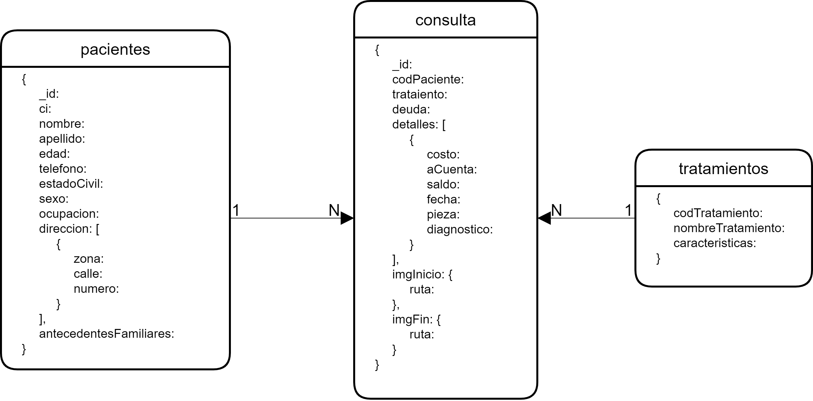
</p>

## Lista de requerimientos del consultorio.

>#### **1.**  _Agregar un nuevo tratamiento._
>#### **2.**  _Registrar un nuevo paciente._
>#### **3.**  _Abrir historial de un nuevo paciente._
>#### **4.**  _Registrar imagenes antes del inicio del tratamiento (para ver el estado de sus dientes antes del tratamiento)._
>#### **5.**  _Se tiene que poder añadir mas imagenes del estado de los dientes del paceinte en el proceso del tratamiento._
>#### **6.**  _Registrar imagenes al finalizar el tratamiento._
>#### **7.**  _Actualizar el saldo de los pacientes, su deuda pendiente con el consultorio._
>#### **8.**  _Ver los pacientes ya pagaron todo._
>#### **9.**  _Ver los paceintes que deben arriba de 2000 Bs._ 
>#### **10.** _Ver el historial de visitas de un paciente._
>#### **11.** _Buscar paciente por ci._
>#### **12.** _Ver los pacientes que estan en un determinado tratamiento._

### Los datos a registrar en la Base de Datos `consultorio` son las siguientes:

- ### Colección tratamientos: ###

>```javascript
>db = connect("localhost:27017/admin");
>db.auth('root', 'root');
>db = db.getSiblingDB('consultorio'); // db = db.getSiblingDB('<nombreDB>'); nombreDB si no existe se crea automaticamente y si existe no existe ningun problema solo se usara la base de datos
>
>
>db.tratamientos.insert([
>    { codTratamiento: "T0001", nombreTratamiento: "Operatorial Dental", caracteristicas: "Modi quia similique non eum nulla nisi. Expedita excepturi totam corporis recusandae praesentium nemo fugiat. Eum laborum officiis fugit corporis inventore praesentium voluptas blanditiis possimus. Voluptatem id reiciendis aut." },
>    { codTratamiento: "T0002", nombreTratamiento: "Cirugia Bucal", caracteristicas: "Alias molestiae quo ipsa soluta doloribus alias corporis. Distinctio eum voluptas et quia nihil quo. Ipsa voluptate beatae minima fuga voluptate eligendi." },
>    { codTratamiento: "T0003", nombreTratamiento: "Periodoncia",caracteristicas: "Explicabo eum tempora quis corrupti nesciunt. Quod quia blanditiis at. Consequatur ea blanditiis eligendi reprehenderit occaecati minima dolore. Cumque quis autem quae. Fugiat neque asperiores ab aspernatur." },
>    { codTratamiento: "T0004", nombreTratamiento: "Ortodoncia", caracteristicas: "Recusandae animi perferendis et ut et laboriosam. Quaerat ipsum culpa officia in accusamus molestias. Adipisci in soluta accusantium voluptatem repellat hic numquam." },
>    { codTratamiento: "T0005", nombreTratamiento: "Odontopediatria", caracteristicas: "Neque necessitatibus fugit velit et aut porro placeat voluptatibus. Sed a et sapiente numquam doloremque dolor. Voluptatem quaerat consequatur atque. Itaque vel et ea quo voluptates. Ullam voluptates dolorem." },
>    { codTratamiento: "T0006", nombreTratamiento: "Patologia Bucal", caracteristicas: "Incidunt corrupti nihil assumenda eligendi sit aut accusantium ipsa. Deleniti qui sed doloribus pariatur vitae ipsam voluptatibus. Rerum ut qui. Corporis voluptas non sint. Dolor soluta deleniti ut eligendi nihil doloribus. Laboriosam recusandae harum labore cumque unde adipisci suscipit." },
>    { codTratamiento: "T0007", nombreTratamiento: "Protesis Fija", caracteristicas: "Repudiandae placeat fugit earum incidunt. Dolores nobis exercitationem sit dolorem provident. Perspiciatis libero minus voluptatum reprehenderit rerum et provident odio voluptatem. Possimus est nihil quasi eos similique a eaque. Laudantium error est quidem doloribus." },
>    { codTratamiento: "T0008", nombreTratamiento: "Protesis Removible", caracteristicas: "Occaecati non temporibus quae at illo. Optio nostrum quia atque. Labore fugit officiis quibusdam architecto beatae omnis. Non et cupiditate sunt nesciunt." },
>    { codTratamiento: "T0009", nombreTratamiento: "Integral Adultos", caracteristicas: "Et porro voluptate dolorem quos itaque. Sint et quia consectetur aliquid doloribus. Sed voluptates id. Voluptas minima beatae odit eius maiores neque reiciendis officiis optio." },
>    { codTratamiento: "T0010", nombreTratamiento: "Integral Niños", caracteristicas: "Deleniti enim neque facere. Id id repudiandae laborum itaque. Et vel laudantium dignissimos et nihil. Eum tempore aut quaerat placeat ut laboriosam." }
>])
>```

- ### Colección pacientes: ###

>```javascript
>db = connect("localhost:27017/admin");
>db.auth('root', 'root');
>db = db.getSiblingDB('consultorio'); // db = db.getSiblingDB('<nombreDB>'); nombreDB si no existe se crea automaticamente y si existe no existe ningun problema solo se usara la base de datos
>
>
>db.pacientes.insert([
>    {
>        _id: "jm6578520",
>        ci: "6578520 LP",
>        nombre: 'juan',
>        apellido: 'martinez',
>        edad: 25,
>        telefono: 1111926005,
>        estadoCivil: 'soltero',
>        sexo: 'M',
>        ocupacion: 'abogado',
>        direccion: [
>            {
>                zona: 'los rosales',
>                calle: 'Colon',
>                numero: 620,
>            }
>        ],
>        antecedenteFamiliares: 'diabetes',
>    },
>    {
>        _id: "fz24581202",
>        ci: '24581202 LP',
>        nombre: 'Felicita',
>        apellido: 'Zboncak',
>        edad: 25,
>        telefono: 6858040670,
>        estadoCivil: 'soltero',
>        sexo: 'F',
>        ocupacion: 'estudiante',
>        direccion: [
>            {
>                zona: 'la merced',
>                calle: 'baptista',
>                numero: 10,
>            }
>        ],
>        antecedenteFamiliares: 'tubercolosis',
>    },
>    {
>        _id: "ta65324175",
>        ci: '65324175 LP',
>        nombre: 'Tanner',
>        apellido: 'Abbott',
>        edad: 10,
>        telefono: 3858427826,
>        estadoCivil: 'soltero',
>        sexo: 'M',
>        ocupacion: 'estudiante',
>        direccion: [
>            {
>                zona: 'villa fatima',
>                calle: '10',
>                numero: 6,
>            }
>        ],
>        antecedenteFamiliares: 'alergias',
>    },
>    {
>        _id: "fz84575201",
>        ci: '84575201 LP',
>        nombre: 'Frederic',
>        apellido: 'Zieme',
>        edad: 25,
>        telefono: 2268651341,
>        estadoCivil: 'casado',
>        sexo: 'M',
>        ocupacion: 'universitario',
>        direccion: [
>            {
>                zona: 'ferrobiario',
>                calle: '25',
>                numero: 20,
>            }
>        ],
>        antecedenteFamiliares: 'ninguna',
>    },
>    {
>        _id: "mc9658350",
>        ci: '9658350 LP',
>        nombre: 'Mabel',
>        apellido: 'Cummings',
>        edad: 50,
>        telefono: 2268651341,
>        estadoCivil: 'viuda',
>        sexo: 'F',
>        ocupacion: 'abogado',
>        direccion: [
>            {
>                zona: 'chuquiaguillo',
>                calle: 'murillo',
>                numero: 650,
>            }
>        ],
>        antecedenteFamiliares: 'cardiopatias',
>    },
>    {
>        _id: "lp12547805",
>        ci: '12547805 LP',
>        nombre: 'Lance',
>        apellido: 'Padberg',
>        edad: 42,
>        telefono: 6458367876,
>        estadoCivil: 'casado',
>        sexo: 'M',
>        ocupacion: 'ingeniero',
>        direccion: [
>            {
>                zona: 'obrajes',
>                calle: '20',
>                numero: 32,
>            }
>        ],
>        antecedenteFamiliares: 'Tuberculosis',
>    },
>    {
>        _id: "vp24536701",
>        ci: '24536701 LP',
>        nombre: 'Vitacita',
>        apellido: 'Parisian',
>        edad: 25,
>        telefono: 6858040670,
>        estadoCivil: 'soltero',
>        sexo: 'F',
>        ocupacion: 'estudiante',
>        direccion: [
>            {
>                zona: 'calacoto',
>                calle: '15',
>                numero: 10,
>            }
>        ],
>        antecedenteFamiliares: 'tubercolosis',
>    },
>    {
>        _id: "nl14785205",
>        ci: '14785205 LP',
>        nombre: 'Nettieer',
>        apellido: 'Langworth',
>        edad: 8,
>        telefono: 9880058113,
>        estadoCivil: 'soltero',
>        sexo: 'M',
>        ocupacion: 'estudiante',
>        direccion: [
>            {
>                zona: 'villa fatima',
>                calle: '30',
>                numero: 60,
>            }
>        ],
>        antecedenteFamiliares: 'ninguna',
>    },
>    {
>        _id: "ch6754102",
>        ci: '6754102 LP',
>        nombre: 'Cindy',
>        apellido: 'Hackett',
>        edad: 29,
>        telefono: 9303681999,
>        estadoCivil: 'casado',
>        sexo: 'M',
>        ocupacion: 'trabajador publico',
>        direccion: [
>            {
>                zona: 'cota cota',
>                calle: '30',
>                numero: 255,
>            }
>        ],
>        antecedenteFamiliares: 'ninguna',
>    },
>    {
>        _id: "sl6951357",
>        ci: '6951357 LP',
>        nombre: 'Serenal',
>        apellido: 'Lowe',
>        edad: 60,
>        telefono: 1347950553,
>        estadoCivil: 'casado',
>        sexo: 'F',
>        ocupacion: 'abogado',
>        direccion: [
>            {
>                zona: 'centro',
>                calle: 'mexico',
>                numero: 180,
>            }
>        ],
>        antecedenteFamiliares: 'cardiopatias',
>    }
>])
>```

- ### Colección consulta: ####

>```javascript
>db = connect("localhost:27017/admin");
>db.auth('root', 'root');
>db = db.getSiblingDB('consultorio'); // db = db.getSiblingDB('<nombreDB>'); nombreDB si no existe se crea automaticamente y si existe no existe ningun problema solo se usara la base de datos
>
>
>db.consulta.insert([
>    {
>        _id: "consulta1",
>        codPaciente:"jm6578520",
>        tratamiento: "Operatoria Dental",
>        deuda: 2700,
>        detalles: [
>            {
>                costo: 3000,
>                aCuenta: 300,
>                saldo: 2700,
>                fecha: 'Sat Apr 27 2019 20:13:43 GMT-0400 (hora de Bolivia)',
>                pieza: "User-centric extend",
>                diagnostico: "Trail Soft"
>            }
>        ],
>        imgInicio: [
>            {
>                ruta: "http://lorempixel.com/640/480/business"
>            }
>        ],
>        imgFin: [
>            {
>                ruta: "http://lorempixel.com/640/480/nature"
>            }
>        ]
>    },
>    {
>        _id: "consulta2",
>        codPaciente:"fz24581202",
>        tratamiento: "Ortodoncia",
>        deuda: 4200,
>        detalles: [
>            {
>                costo: 5000,
>                aCuenta: 800,
>                saldo: 4200,
>                fecha: 'Mon Jul 22 2019 11:05:33 GMT-0400 (hora de Bolivia)',
>                pieza: "Extension",
>                diagnostico: "Arizona Buckinghamshire bypassing"
>            }
>        ],
>        imgInicio: [
>            {
>                ruta: "http://lorempixel.com/640/480/cats"
>            }
>        ],
>        imgFin: [
>            {
>                ruta: "http://lorempixel.com/640/480/transport"
>            }
>        ]
>    },
>    {
>        _id: "consulta3",
>        codPaciente:"ta65324175",
>        tratamiento: "Odontopeditria",
>        deuda: 1500,
>        detalles: [
>            {
>                costo: 2500,
>                aCuenta: 500,
>                saldo: 2000,
>                fecha: 'Tue Nov 05 2019 00:23:25 GMT-0400 (hora de Bolivia)',
>                pieza: "primary",
>                diagnostico: "invoice"
>            },
>            {
>                costo: 2500,
>                aCuenta: 500,
>                saldo: 1500,
>                fecha: 'Sun Nov 10 2019 16:23:55 GMT-0400 (hora de Bolivia)',
>                pieza: "turn-key",
>                diagnostico: "program transmitting Concrete"
>            }
>        ],
>        imgInicio: [
>            {
>                ruta: "http://lorempixel.com/640/480/technics"
>            }
>        ],
>        imgFin: [
>            {
>                ruta: "http://lorempixel.com/640/480/people"
>            }
>        ]
>    },
>    {
>        _id: "consulta4",
>        codPaciente:"fz84575201",
>        tratamiento: "Periodoncia",
>        deuda: 3400,
>        detalles: [
>            {
>                costo: 3600,
>                aCuenta: 200,
>                saldo: 3400,
>                fecha: 'Tue Nov 05 2019 00:23:25 GMT-0400 (hora de Bolivia)',
>                pieza: "Ergonomic Fresh Gloves program",
>                diagnostico: "program haptic Versatile"
>            }
>        ],
>        imgInicio: [
>            {
>                ruta: "http://lorempixel.com/640/480/nature"
>            }
>        ],
>        imgFin: [
>            {
>                ruta: "http://lorempixel.com/640/480/sports"
>            }
>        ]
>    },
>    {
>        _id: "consulta5",
>        codPaciente:"mc9658350",
>        tratamiento: "Patologia Bucal",
>        deuda: 1000,
>        detalles: [
>            {
>                costo: 1200,
>                aCuenta: 200,
>                saldo: 1000,
>                fecha: 'Fri Apr 10 2020 23:46:39 GMT-0400 (hora de Bolivia)',
>                pieza: "RAM New Hampshire",
>                diagnostico: "Colorado SQL"
>            }
>        ],
>        imgInicio: [
>            {
>                ruta: "http://lorempixel.com/640/480/sports"
>            }
>        ],
>        imgFin: [
>            {
>                ruta: "http://lorempixel.com/640/480/nature"
>            }
>        ]
>    },
>    {
>        _id: "consulta6",
>        codPaciente:"lp12547805",
>        tratamiento: "Cirugia Bucal",
>        deuda: 2200,
>        detalles: [
>            {
>                costo: 2500,
>                aCuenta: 300,
>                saldo: 2200,
>                fecha: 'Sat Apr 27 2019 20:13:43 GMT-0400 (hora de Bolivia)',
>                pieza: "Gorgeous redundant",
>                diagnostico: "Gorgeous ADP Saint Barthelemy"
>            }
>        ],
>        imgInicio: [
>            {
>                ruta: "http://lorempixel.com/640/480/cats"
>            }
>        ],
>        imgFin: [
>            {
>                ruta: "http://lorempixel.com/640/480/cats"
>            }
>        ]
>    },
>    {
>        _id: "consulta7",
>        codPaciente:"vp24536701",
>        tratamiento: "Ortodoncia",
>        deuda: 4200,
>        detalles: [
>            {
>                costo: 5000,
>                aCuenta: 800,
>                saldo: 4200,
>                fecha: 'Fri May 03 2019 03:43:04 GMT-0400 (hora de Bolivia)',
>                pieza: "XSS circuit transmit",
>                diagnostico: "integrated Shirt engineer"
>            }
>        ],
>        imgInicio: [
>            {
>                ruta: "http://lorempixel.com/640/480/nature"
>            }
>        ],
>        imgFin: [
>            {
>                ruta: "http://lorempixel.com/640/480/city"
>            }
>        ]
>    },
>    {
>        _id: "consulta8",
>        codPaciente:"nl14785205",
>        tratamiento: "OdontoPediatria",
>        deuda: 1400,
>        detalles: [
>            {
>                costo: 2500,
>                aCuenta: 600,
>                saldo: 1900,
>                fecha: 'Tue Nov 05 2019 00:23:25 GMT-0400 (hora de Bolivia)',
>                pieza: "installation",
>                diagnostico: "British Indian Ocean Territory (Chagos Archipelago)"
>            },
>            {
>                costo: 2500,
>                aCuenta: 500,
>                saldo: 1400,
>                fecha: 'Sun Nov 10 2019 16:23:55 GMT-0400 (hora de Bolivia)',
>                pieza: "redefine",
>                diagnostico: "Venezuela"
>            }
>        ],
>        imgInicio: [
>            {
>                ruta: "http://lorempixel.com/640/480/sports"
>            }
>        ],
>        imgFin: [
>            {
>                ruta: "http://lorempixel.com/640/480/transport"
>            }
>        ]
>    },
>    {
>        _id: "consulta9",
>        codPaciente:"ch6754102",
>        tratamiento: "Protesis Fija",
>        deuda: 3200,
>        detalles: [
>            {
>                costo: 3600,
>                aCuenta: 400,
>                saldo: 3200,
>                fecha: 'Tue Nov 05 2019 00:23:25 GMT-0400 (hora de Bolivia)',
>                pieza: "Cambridgeshire",
>                diagnostico: "Assistant Grenada encoding"
>            }
>        ],
>        imgInicio: [
>            {
>                ruta: "http://lorempixel.com/640/480/abstract"
>            }
>        ],
>        imgFin: [
>            {
>                ruta: "http://lorempixel.com/640/480/cats"
>            }
>        ]
>    },
>    {
>        _id: "consulta10",
>        codPaciente:"sl6951357",
>        tratamiento: "Integral Adultos",
>        deuda: 1000,
>        detalles: [
>            {
>                costo: 1200,
>                aCuenta: 200,
>                saldo: 1000,
>                fecha: 'Sat Jul 13 2019 10:29:04 GMT-0400 (hora de Bolivia)',
>                pieza: "digital Brook",
>                diagnostico: "throughput Plastic"
>            }
>        ],
>        imgInicio: [
>            {
>                ruta: "http://lorempixel.com/640/480/food"
>            }
>        ],
>        imgFin: [
>            {
>                ruta: "http://lorempixel.com/640/480/transport"
>            }
>        ]
>    }
>])
>```

## Consultas que se requieren desde analisis de requerimientos.

#### **1.**  _Agregar un nuevo tratamiento._

>```javascript
>//? adicionar un nuevo tratamiento
>
>db.tratamientos.insert(
>    {
>        codTratamiento: "T0011",
>        nombreTratamiento: "Otro tratamiento",
>        caracteristicas: "Alias molestiae quo ipsa soluta doloribus alias corporis. Distinctio eum voluptas et quia nihil quo. Ipsa voluptate beatae minima fuga voluptate eligendi."
>    }
>)
>
>
>db.tratamientos.deleteOne(
>    {
>        codTratamiento: "T0011"
>    }
>)
>```

#### **2.**  _Registrar un nuevo paciente._

>```javascript
>//? insertar nuevo paciente
>
>db.pacientes.insert(
>    {
>        _id: "gs32165498",
>        ci: '32165498 LP',
>        nombre: 'Gonzalo',
>        apellido: 'Sanchez',
>        edad: 29,
>        telefono: 4653734748,
>        estadoCivil: 'soltero',
>        sexo: 'M',
>        ocupacion: 'obrero',
>        direccion: [
>            {
>                zona: 'las delicias',
>                calle: 'bellman',
>                numero: 159,
>            }
>        ],
>        antecedenteFamiliares: 'Tuberculosis',
>    },
>)
>```

#### **3.**  _Abrir historial de un nuevo paciente._

>```javascript
>//? abrir su historial del nuevo paciente
>
>db.consulta.insert(
>    {
>        _id: "consulta11",
>        codPaciente:"gs32165498",
>        tratamiento: "Operatoria Dental",
>        deuda: 2000,
>        detalles: [
>            {
>                costo: 3000,
>                aCuenta: 1000,
>                saldo: 2000,
>                fecha: new Date(),
>                pieza: "User-centric extend",
>                diagnostico: "Trail Soft"
>            }
>        ],
>    }
>)
>
>
>db.consulta.deleteOne(
>    {
>        _id: "consulta11"
>    }
>)
>```

#### **4.**  _Registrar imagenes antes del inicio del tratamiento (para ver el estado de sus dientes antes del tratamiento)._

>```javascript
>//? insertar imagenes antes del inicio del tratamiento
>
>db.consulta.update(
>    {
>        codPaciente: "gs32165498",
>        _id: "consulta11",
>    },
>    {
>        $push : {imgInicio: {ruta: "http://lorempixel.com/640/480/technics"}}
>    }
>)
>```

#### **5.**  _Se tiene que poder añadir mas imagenes del estado de los dientes del paciente en el proceso del tratamiento._

>```javascript
>//? añadir mas imagenes del estado de los dientes del paceinte paciente
>
>db.consulta.update(
>    {
>        codPaciente: "gs32165498",
>        _id: "consulta11",
>    },
>    {
>        $push : {imgInicio: {ruta: "http://lorempixel.com/640/480/city"}}
>    }
>)
>
>
>db.consulta.update(
>    {
>        codPaciente: "gs32165498",
>        _id: "consulta11",
>    },
>    {
>        $push : {imgInicio: {ruta: "http://lorempixel.com/640/480/business"}}
>    }
>)
>```

#### **6.**  _Registrar imagenes al finalizar el tratamiento._

>```javascript
>//? insertar imagenes al finalizar el tratamiento
>
>db.consulta.update(
>    {
>        codPaciente: "gs32165498",
>        _id: "consulta11",
>    },
>    {
>        $push : {imgFin: {ruta: "http://lorempixel.com/640/480/technics"}}
>    }
>)
>
>
>//? añadir mas imagenes del resultado de los dientes del paceinte paciente
>
>db.consulta.update(
>    {
>        codPaciente: "gs32165498",
>        _id: "consulta11",
>    },
>    {
>        $push : {imgFin: {ruta: "http://lorempixel.com/640/480/nature"}}
>    }
>)
>
>
>db.consulta.update(
>    {
>        codPaciente: "gs32165498",
>        _id: "consulta11",
>    },
>    {
>        $push : {imgFin: {ruta: "http://lorempixel.com/640/480/nature"}}
>    }
>)
>
>```

#### **7.**  _Actualizar el saldo de los pacientes, su deuda pendiente con el consultorio._

>```javascript
>//? actualizar el saldo de los pacientes su deuda pendiente
>
>db.consulta.update(
>    {
>        codPaciente: "gs32165498",
>        _id: "consulta11",
>    },
>    {
>        $push : {detalles: 
>            {
>                costo : 3000,
>                aCuenta : 800,
>                saldo : 1200,
>                fecha : new Date(),
>                pieza : "User-centric extend",
>                diagnostico : "Trail Soft"
>            }
>        }
>    }
>)
>
>
>db.consulta.update(
>    {
>        codPaciente: "gs32165498",
>        _id: "consulta11",
>    },
>    {
>        $set : {
>            deuda: 1200
>        }
>    }
>)
>
>//? Aqui el paciente paga todo su deuda y ya no deberá mas.
>
>db.consulta.update(
>    {
>        codPaciente: "gs32165498",
>        _id: "consulta11",
>    },
>    {
>        $push : {detalles: 
>            {
>                costo : 3000,
>                aCuenta : 1200,
>                saldo : 0,
>                fecha : new Date(),
>                pieza : "User-centric extend",
>                diagnostico : "Trail Soft"
>            }
>        }
>    }
>)
>
>
>db.consulta.update(
>    {
>        codPaciente: "gs32165498",
>        _id: "consulta11",
>    },
>    {
>        $set : {
>            deuda: 0
>        }
>    }
>)
>
>```

#### **8.**  _Ver los pacientes ya pagaron todo._

>```javascript
>//? ver que paccientes ya pagaron todo
>
>db.consulta.aggregate([
>    { $match: { "detalles.saldo": 0} },
>    {
>        $lookup:
>        {
>            from: "pacientes",
>            localField: "codPaciente",
>            foreignField: "_id",
>            as: "paciente"
>        }
>    },   
>])
>
>```

#### **9.**  _Ver los paceintes que deben arriba de 2000 Bs._

>```javascript
>//?  ver los paceintes que deben arriba de 2000 Bs  
>
>db.consulta.aggregate([
>    { $match: { "deuda": { $lt: 2000 }} },
>    {
>        $lookup:
>        {
>            from: "pacientes",
>            localField: "codPaciente",
>            foreignField: "_id",
>            as: "paciente"
>        }
>    },   
>])
>```

#### **10.** _Ver el historial de visitas de un paciente._

>```javascript
>//? ver el hostorial de visitas de una paciente 
>
>//? La forma mas corta
>
>db.consulta.find({codPaciente: {$regex: '32165498', '$options' : 'i'}},{detalles: 1})
>
>//? Una forma larga pero tambien podemos obtener los datos del paciente con que no se puede con la anterior forma.
>
>db.consulta.aggregate([
>    { $match: { codPaciente: {$regex: '32165498', '$options' : 'i'}} },
>    {
>        $lookup:
>        {
>            from: "pacientes",
>            localField: "codPaciente",
>            foreignField: "_id",
>            as: "paciente"
>        }
>    },
>    { $unwind: "$paciente" },
>    {
>        $project: {
>            __v: 0,
>            "paciente.__v": 0,
>            "paciente._id": 0,
>            "paciente.direccion": 0,
>            "imgInicio": 0,
>            "imgFin": 0
>        }
>    },   
>])
>
>```

#### **11.** _Buscar paciente por ci._

>```javascript
>//? buscar paciente por ci
>
>db.pacientes.find({ci: {$regex: '6578520', '$options' : 'i'}})
>
>```

#### **12.** _Ver los pacientes que estan en un determinado tratamiento._

>```javascript
>//? ver los pacientes que estan en un determinado tratamiento
>
>db.consulta.aggregate([
>    { $match: { tratamiento: "Ortodoncia"} },
>    {
>        $lookup:
>        {
>            from: "pacientes",
>            localField: "codPaciente",
>            foreignField: "_id",
>            as: "paciente"
>        }
>    },
>    { $unwind: "$paciente" },
>    {
>        $project: {
>            __v: 0,
>            "paciente.__v": 0,
>            "paciente._id": 0
>        }
>    },
>])
>
>```

Todos estos datos y consultas se realizaron en el contenedor `mongo` creado en la anterior tarea ([tarea 4](https://github.com/cristianfchq/EjerciciosMeanStack/tree/master/Tarea%204))


## Crear usuarios de Autentificación.

- Ususario con permisos de solo lectura.

>```javascript
>db.createUser(
>  {
>    user: "cliente",
>    pwd: "cliente",
>    roles: [{ role: "read", db: "consultorio" }]
>  }
>)
>```

- Usuario con permisos de lectura y escritura.

>```javascript
>db.createUser(
>    {
>        user: "cristian",
>        pwd: "cristian",
>        roles: [{ role: "readWrite", db: "consultorio" }]
>    }
>)
>```

## Crear la base de datos en Mongodb Atlas 

Primeramente debe crear una cuenta en [mongodb Atlas](https://www.mongodb.com/cloud/atlas), registrese [aqui](https://account.mongodb.com/account/register).

Una vez creada su cuenta y logeado en mongoDB Atlas, le aparecera lo siguiente, se debe construir un Cluster (click a `Build a Cluster`)

<p align="center">
  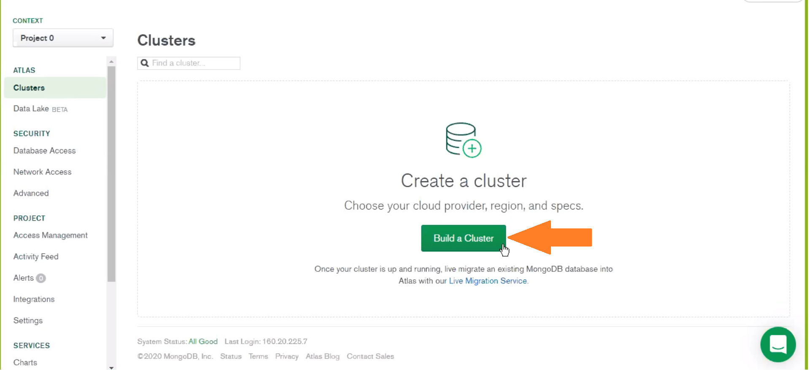
</p>

Posteriormente crear cluster (click en `Create a Cluster`).

<p align="center">
  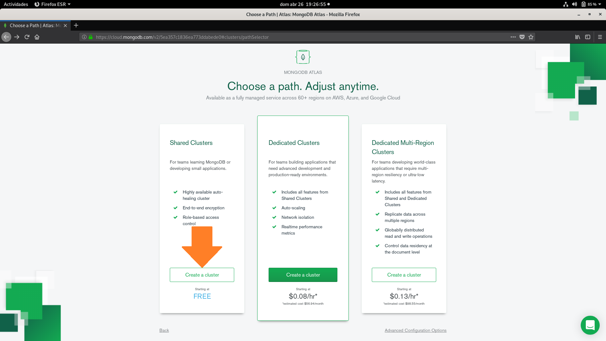
</p>

<p align="center">
  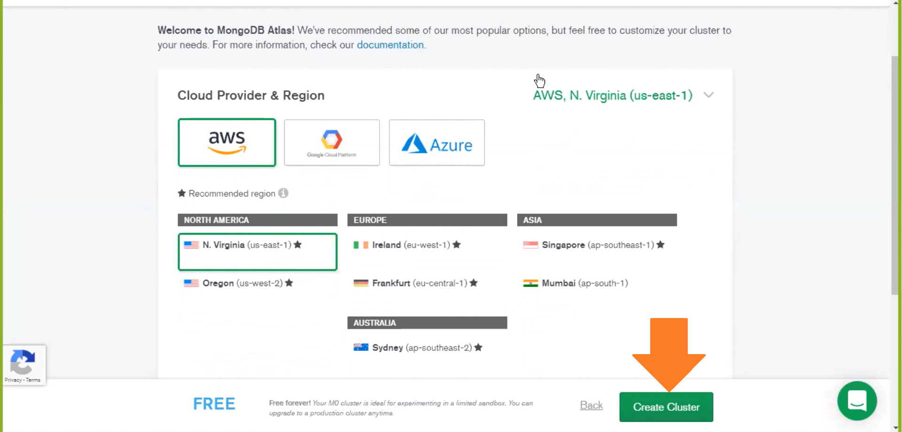
</p>

Luego de creada el cluster ir a colecciones (click en `COLLECTIONS`).

<p align="center">
  
</p>

Ahora crearemos nuestra base de datos (click en `Add My Own Data`)

<p align="center">
  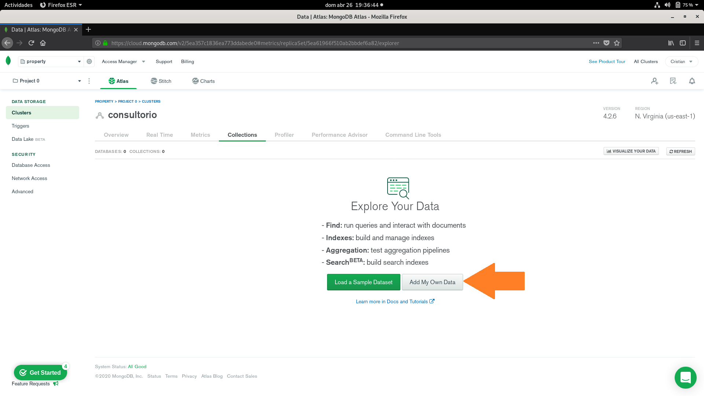
</p>

Le colocaremos un nombre a nuestra base de datos y un nombre de una colección de nuestra base de datos y luego le damos click a `create`.

<p align="center">
  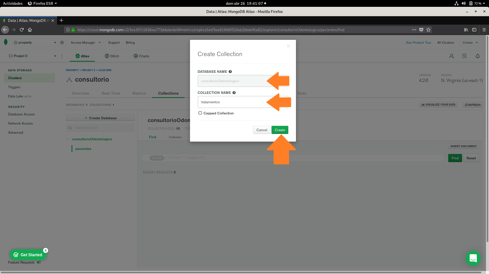
</p>

Una vez creada la colección podemos empezar a insertar los documentos dandole click a `INSERT DOCUMENT`, pero nosotros lo haremos con **robo 3T** que es mucho mas facil.

<p align="center">
  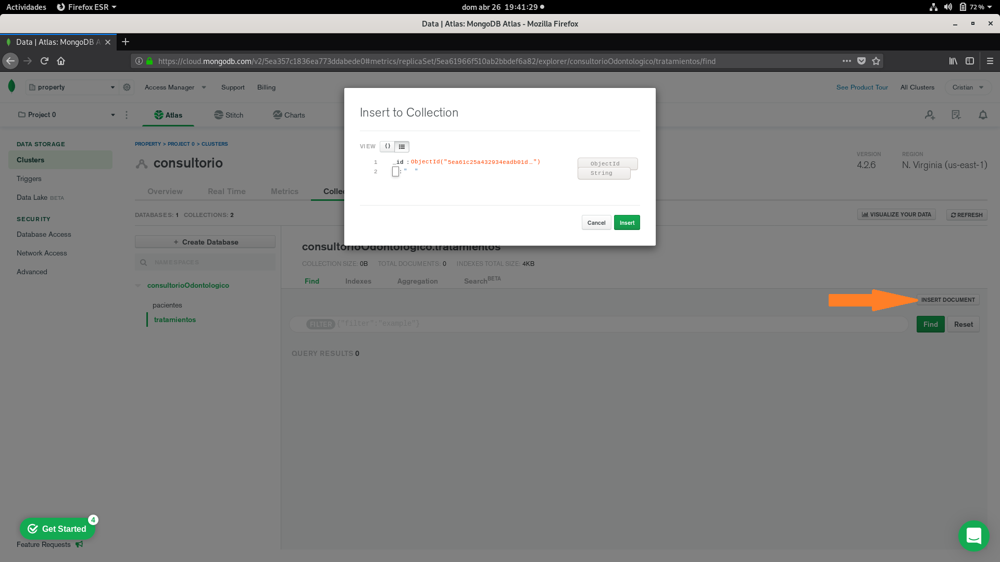
</p>

Paro esto es necesario conectar nuestro **Robo 3T** con **MongoDB Atlas**, se recomienda visitar la siguiente pagina [aqui](https://medium.com/@samurc.net/crear-mongodb-atlas-y-conectarse-usando-robo-3t-ex-robomongo-15781eebd7f4), que siguiendo los pasos de esa pagina me funciono correctamente sin ningun problema.

Adjunto algunas imagenes del proceso.

<p align="center">
  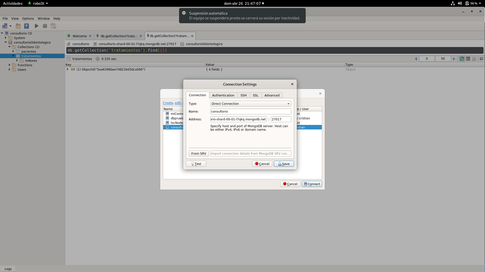
</p>

<p align="center">
  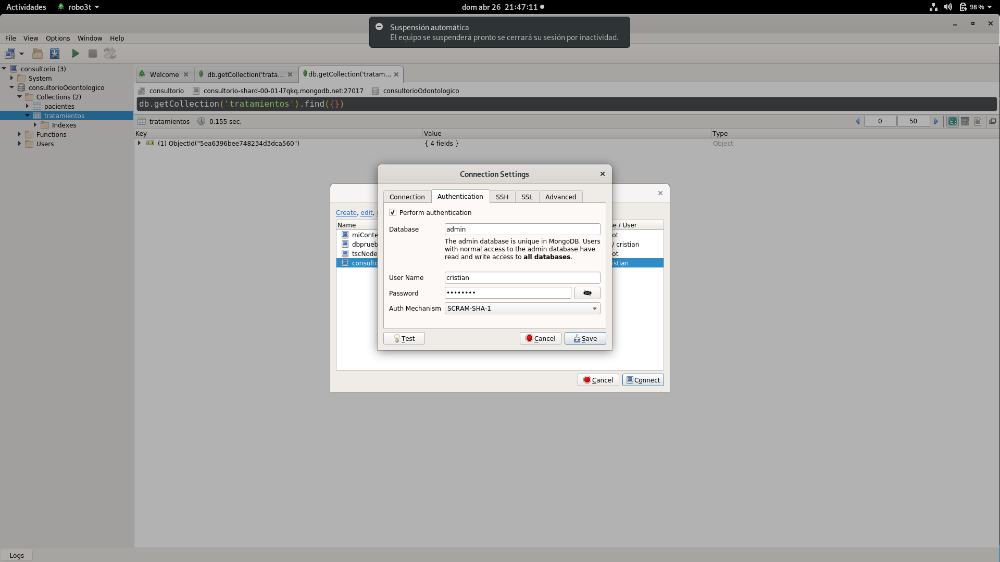
</p>

<p align="center">
  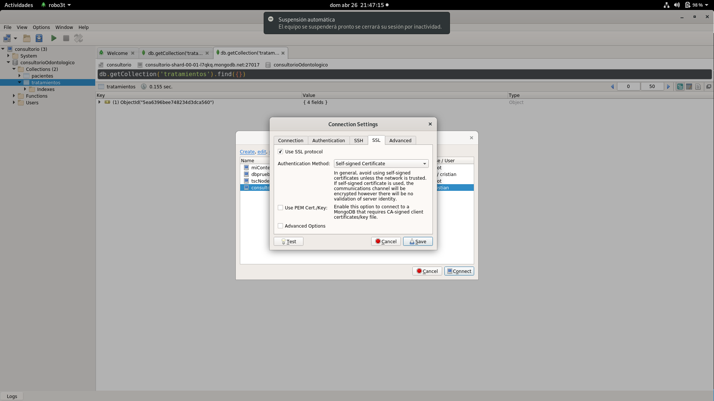
</p>

Una vez conectado a **Robo 3T** se puede trabajar de manera grafica y se puede copiar el codigo donde insertamos los documentos de nuestra base de datos anteriormente.

Veremos que todos los datos insertados en **Robo 3T** se puede ver en mongoDB Atlas y asi ya tenemos nuestra base de datos **consultorio en mi caso** corriendo en **MongoDB Atlas**.

<p align="center">
  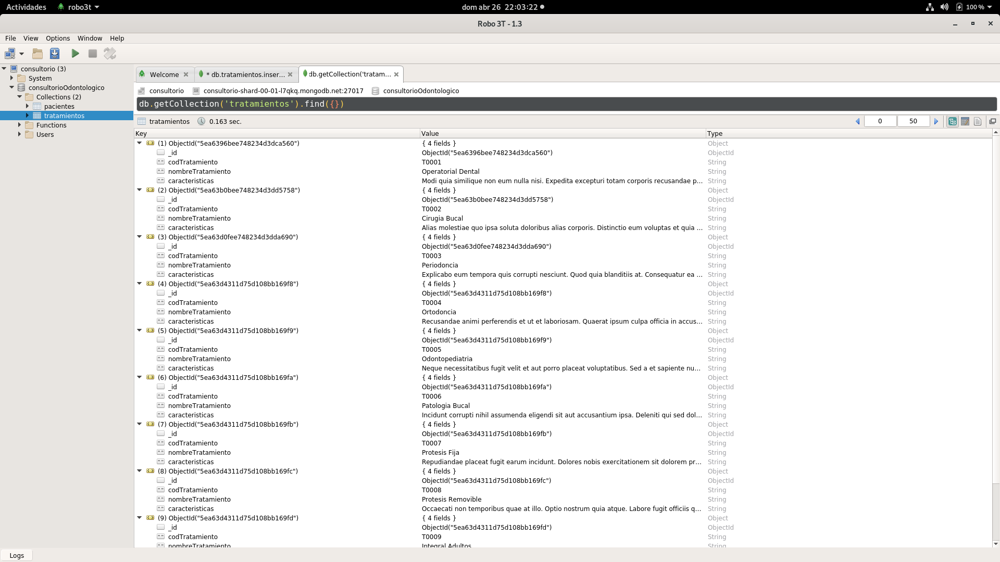
</p>

<p align="center">
  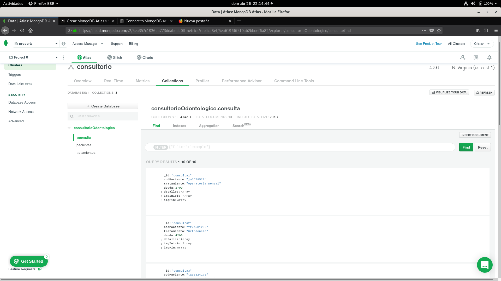
</p>

<p align="center">
  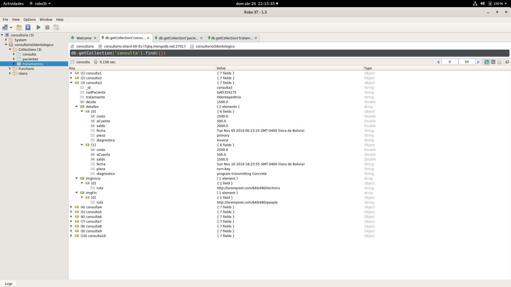
</p>


